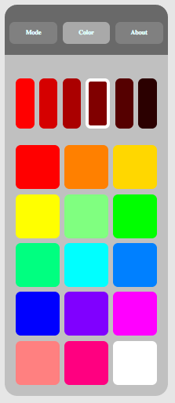

# Remote for RGB led strip

Copyright (C) 2016 Christux 
License GPL : http://www.gnu.org/copyleft/gpl.html

## Summary :

Javascript remote for RGB led strip controled by ESP-12E ship.</b>
ESP8266 code is available here : <a href="https://github.com/Christux/Arduino/tree/master/NodeMCU_NeoPixel_Lamp">https://github.com/Christux/Arduino/tree/master/NodeMCU_NeoPixel_Lamp</a>

## Screenshots :

  
  

